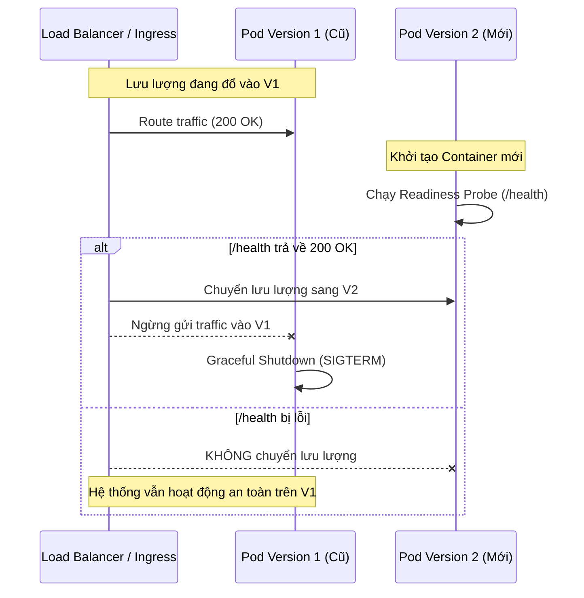

# 🚀 LAB 04: Continuous Delivery (CD) & Triển khai Zero-Downtime

## 🎯 Mục tiêu bài học
1. Hiểu sự khác biệt giữa **Continuous Delivery** (Chờ duyệt thủ công trước khi lên Production) và **Continuous Deployment** (Tự động 100%).
2. Thiết lập cơ chế **Rolling Update** trên Docker Compose & Kubernetes để cập nhật phiên bản mới mà không bị gián đoạn dịch vụ (Zero-Downtime).
3. Thực hiện **Health Check & Auto-Rollback** khi service mới bị lỗi khởi động (CrashLoopBackOff).

---

## 🔄 1. Nguyên lý Rolling Update & Health Checks



---

## 🛠️ 2. Thử nghiệm trên Local với Docker Compose
```bash
# Khởi chạy cụm dịch vụ Production-like:
docker compose -f deployments/docker-compose/docker-compose.prod.yml up -d --build

# Kiểm tra trạng thái và logs:
docker compose -f deployments/docker-compose/docker-compose.prod.yml ps
curl http://localhost:8000/health
curl http://localhost:3000/health
```
